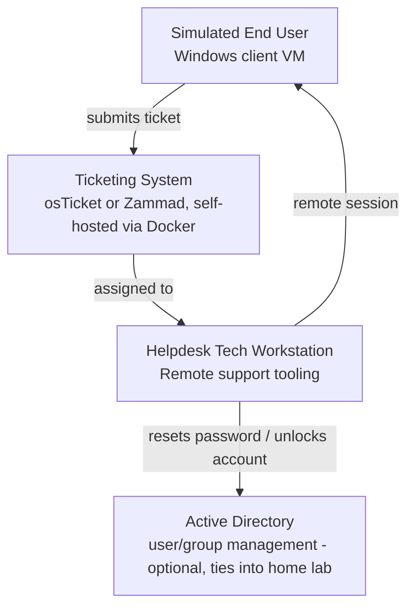

# Helpdesk Lab

> Part of my [IT & Cybersecurity Portfolio](https://github.com/owenncampbell/it-cybersecurity-portfolio)

A simulated helpdesk environment for practicing IT support fundamentals: ticket intake and triage, an end-user support environment, and troubleshooting runbooks for common issues. This document is the design plan — update it with real screenshots, ticket examples, and notes as each piece gets built.

## Planned architecture

## Why this design

- **Ticketing system** (osTicket/Zammad) gives real experience with intake, categorization, prioritization, and closing tickets — the core workflow of any helpdesk role.
- **End-user client VM** lets me generate realistic support scenarios (printer issues, slow performance, connectivity problems) to practice diagnosing and documenting them.
- **Remote support tooling** (e.g. RustDesk, Windows Remote Assistance) mirrors how real helpdesk techs assist users without physical access.
- **AD integration** (once the home lab exists) adds real account/group management tasks — password resets, lockouts, permission issues.

## Build log

| Date | Component | Status | Notes |
|---|---|---|---|
| 2026-08-31 | Ticketing system install (Docker) | ✅ Running | Real osTicket instance via Docker Compose — see [`ticketing-system/`](ticketing-system/) |
| _TBD_ | End-user client VM | Not started | Needs a Windows license/ISO — my own work to do |
| _TBD_ | Remote support tool setup | Not started | |
| _TBD_ | AD integration | Not started | Depends on home lab existing |

## Contents

- [`ticketing-system/`](ticketing-system/) — setup notes for the self-hosted ticketing system
- [`runbooks/`](runbooks/) — troubleshooting runbooks for common ticket types

## Tools

- Ticketing: [osTicket](https://osticket.com/) (running — see [`ticketing-system/`](ticketing-system/))
- Remote support: [RustDesk](https://rustdesk.com/) (open-source) or Windows Remote Assistance
- Client OS: Windows 10/11 VM
