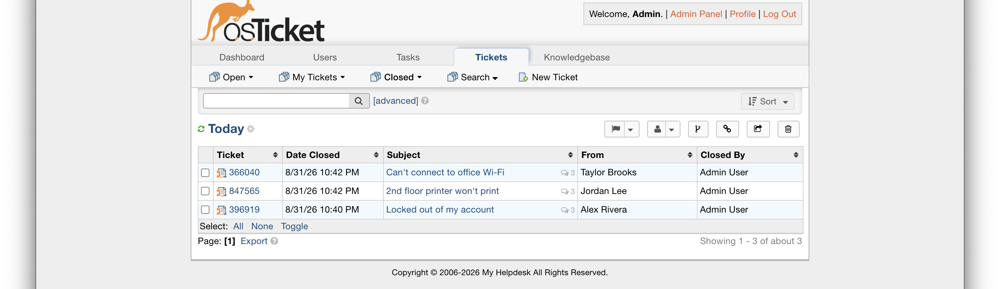
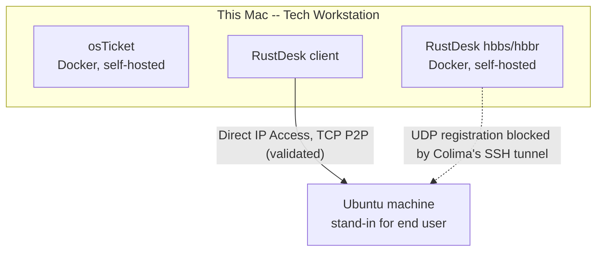

# Helpdesk Lab

> Part of my [IT & Cybersecurity Portfolio](https://github.com/owenncampbell/it-cybersecurity-portfolio)

A simulated helpdesk environment built to practice and demonstrate the core IT support workflow of taking a ticket, triaging it, working it to resolution, and documenting it clearly. This project includes running infrastructure (Docker containers, a ticketing system, and a self-hosted remote-support server).

## What this demonstrates

- **Ticket triage & categorization** — 4 departments and 4 help topics, each mapped to a specific escalation path. See [`ticketing-system/categories.md`](ticketing-system/categories.md).
- **Troubleshooting methodology** — 4 runbooks covering the most common Tier 1 ticket types, each following the same plan: triage questions → diagnostic steps → resolution → escalation criteria. See [`runbooks/`](runbooks/).
- **Real ticket handling** — 4 worked example tickets with internal triage notes and customer-facing replies, one left open intentionally to show a realistic in-progress queue. See [`ticketing-system/example-tickets.md`](ticketing-system/example-tickets.md).
- **Remote support tooling** — a self-hosted RustDesk server, with a peer-to-peer connection validated end-to-end between two physical machines. See [`remote-support/`](remote-support/).

## Actual architecture

This is what's actually running: osTicket and the RustDesk server both live in Docker Compose stacks on this Mac, and a second physical machine (Ubuntu, standing in for an end user) is used to validate remote support over the LAN. The self-hosted `hbbs`/`hbbr` server is up but unreachable over UDP under Colima (see [`remote-support/`](remote-support/) for the diagnosis), so the actual validated path is RustDesk's Direct IP Access, bypassing it.

## Why this design

- **Ticketing system** gives real experience with intake, categorization, prioritization, and closing tickets — the core workflow of any helpdesk role.
- **Troubleshooting runbooks** turn general IT support knowledge into a repeatable process, then get refined against real worked tickets.
- **Remote support tooling** mirrors how real helpdesk techs assist users without physical access to the machine — validated here via RustDesk Direct IP Access between two real machines, since the self-hosted rendezvous server is currently blocked by a Colima networking limitation (documented in [`remote-support/`](remote-support/)).

## Build log

| Date | Component | Status | Notes |
|---|---|---|---|
| 2026-08-31 | Ticketing system install (Docker) | ✅ Running | Real osTicket instance via Docker Compose — see [`ticketing-system/`](ticketing-system/) |
| 2026-09-01 | Remote support tool setup (Docker) | ✅ Running | Self-hosted RustDesk server (hbbs/hbbr) via Docker Compose — see [`remote-support/`](remote-support/) |
| 2026-09-02 | Remote support connectivity validated | ✅ Validated | Self-hosted server's UDP registration is blocked by a Colima networking limitation (documented); validated remote support the way it's actually used — RustDesk Direct IP Access, tested end-to-end between two real machines — see [`remote-support/`](remote-support/) |

## Contents

- [`ticketing-system/`](ticketing-system/) — setup notes for the self-hosted ticketing system, ticket categorization, and worked example tickets
- [`remote-support/`](remote-support/) — setup notes for the self-hosted RustDesk server, including a real networking issue hit and worked around
- [`runbooks/`](runbooks/) — troubleshooting runbooks for common ticket types

## Tools

- Ticketing: [osTicket](https://osticket.com/), self-hosted (running — see [`ticketing-system/`](ticketing-system/))
- Remote support: [RustDesk](https://rustdesk.com/), self-hosted server + client (running, connectivity validated via Direct IP Access — see [`remote-support/`](remote-support/))
- Container runtime: Docker Compose on [Colima](https://github.com/abiosoft/colima) (macOS)
- End-user stand-in: a second physical machine running Ubuntu, used to validate remote support over the LAN
